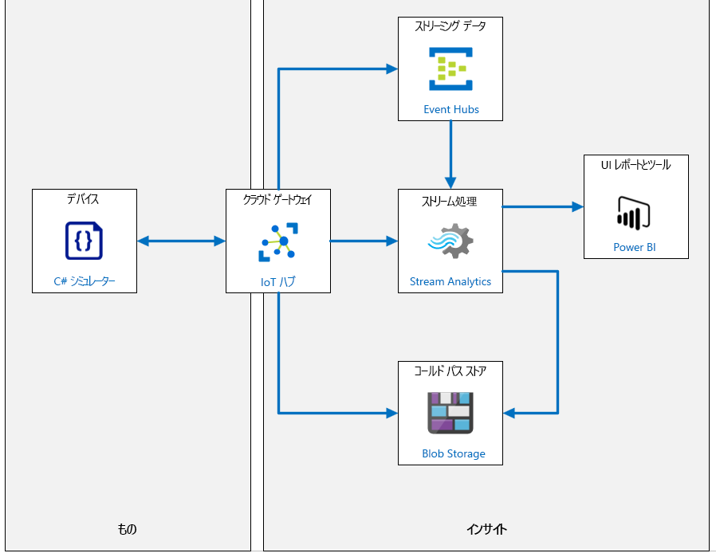
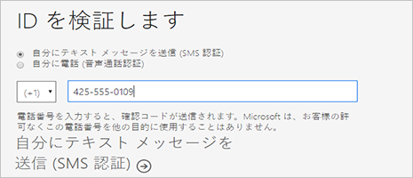
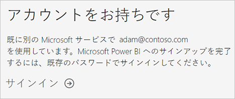
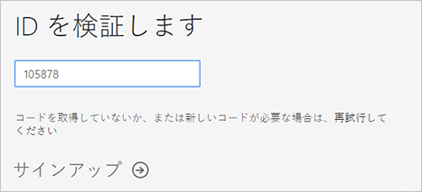
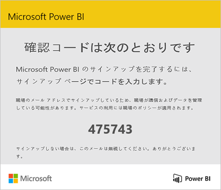
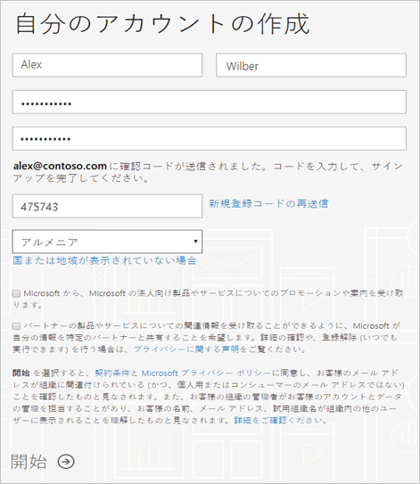

---
lab:
    title: 'ラボ 08: Power BI でデータ ストリームを視覚化する'
    module: 'モジュール 5: インサイトとビジネス インテグレーション'
---

# Power BI でデータ ストリームを視覚化する

> **注意**:  このラボは、「ラボ 7 - デバイス メッセージ ルーティング」の続きです。
>
> **重要**: このラボには、コース用に提供された Azure サブスクリプションとは関係なく、次のように複数のサービスの前提条件があります。
>
> 1. 「職場または学校アカウント」にサインインする機能 (Azure Active Directory アカウント)
> 2. アカウントのサインイン名を知っている必要があります。ただし、電子メール アドレスと一致しない場合があります。
> 3. Power BI へのアクセスは、次の方法で行われます。
>       1. 既存の Power BI アカウント
>       2. Power BI にサインアップする機能 - 一部の組織はこれをブロックします。
>
> 最初のラボの演習では、Power BI にアクセスする機能を検証します。  最初の演習で成功しなかった場合は、職場または学校のアカウントに対してブロックされたアクセスに対する簡易的な回避策がないため、ラボを完了できません。

## ラボ シナリオ

Contoso のチーズ パッケージング プロセスで使用されるコンベア ベルト システムの典型的な振動データとその他のテレメトリ出力を生成する、シミュレートされた IoT デバイスを開発しました。Azure BLOB ストレージにデータを送信するログ ルートを構築して、テストしました。テレメトリ データを Azure Event Hubs サービスに送信する IoT ハブ内の新しいルートの作業を開始します。

Azure IoT Hub と Azure Event Hubs の主な違いは、Event Hubs はビッグ データ ストリーミングのために設計されているのに対して、IoT ハブは IoT ソリューションに最適化されている点です。どちらのサービスも、低遅延と高い信頼性でデータの取り込みをサポートします。Azure Event Hubs では IoT Hub と似た方法による Stream Analytics の入力を提供するため、この場合には、選択した Event Hubs により、ソリューション内の追加の Azure サービス オプションを探索できます。

### 組み込みの機械学習モデルへの呼び出し

呼び出しの対象となる組み込み機械学習 (ML) 関数は `AnomalyDetection_SpikeAndDip` です。

`AnomalyDetection_SpikeAndDip` 関数は、データのスライディング ウィンドウを取り、異常を調べます。スライディング ウィンドウは、たとえば、テレメトリ データの最新の 2 分間である可能性があります。このスライディング ウィンドウは、リアルタイムに近いテレメトリの流れで対応します。スライディング ウィンドウのサイズが大きくなると、一般に異常検出の精度も高くなります。待ち時間も同様です。

データの流れが続くにつれて、アルゴリズムは通常の値の範囲を確立し、その標準と新しい値を比較します。結果は各値のスコアであり、指定された値が異常であるという信頼度を決めるパーセンテージです。低いは信頼度は無視されますが、信頼度の値が許容される割合が問題です。クエリでは、この転換点を 95% に設定します。

データにギャップがある場合 (コンベア ベルトはしばらくの間、停止します) のように、常に複雑な問題があります。アルゴリズムは、値を補完することによってデータのボイドを処理します。

> **注意**: 統計では、補完は欠損データを代入値に置き換えるプロセスになります。補完の詳細については、[ここ](https://en.wikipedia.org/wiki/Imputation_%28statistics%29)を参照してください。

利用統計情報の急上昇と急下降は一時的な異常です。ただし、振動の正弦波を扱うため、異常警報を引き起こす高い値または低い値の後に短い期間の「正常」値が続くと予想できます。オペレーターは、短時間に発生する異常のクラスターを探しています。このようなクラスターは、何かが誤っていることを示唆しています。

この他にも、トレンドを検出するモデルなど、組み込み ML モデルがあります。このモジュールの一部としてこれらのモデルは含まれていませんが、受講生はさらに深く調査するといいでしょう。

### Power BI を使用したデータを視覚化する

数値データ、特に大量のデータを可視化することは、それ自体が課題です。何かが間違っていると推測する異常のシーケンスを人間のオペレータに警告する方法とは?

このモジュールに使用するソリューションは、Power BI が取得できるリアルタイム形式のデータを送信するために、Azure Stream Analytics の機能と共に、Power BI の一部の組み込み機能を使用することです。

Power BI のダッシュボード機能を使用して、多数のタイルを作成します。1 つのタイルには、実際の振動測定が含まれます。もう 1 つのタイルはゲージで、値が異常であることを 0.0 から 1.0 の信頼度で示します。3 番目のタイルでは、95% の信頼度に達したかどうかを示します。最後に、4 番目のタイルは、過去 1 時間で検出された異常の数を示します。X軸として時間を含めることによって、このタイルは、複数の異常が水平に一緒にクラスタリングされるため、短時間で連続して検出されたかどうかを明確にします。

4 番目のタイルを使用すると、テレメトリ コンソール ウィンドウ内の赤いテキストと異常を比較できます。振動が強制的に実行された場合、または増加した場合、またはその両方が発生したときに異常のクラスターが検出されていますか?

次のリソースが作成されます。



## このラボでは

このラボでは、次のタスクを完了します。

* Power BI へのサインアップ
* ラボの前提条件が満たされていることを確認する (必要な Azure リソースがあること)
* リアルタイムでテレメトリを分析する
* Azure Event Hubs サービスを作成する
* リアルタイム メッセージ ルートの作成
* IoT ハブにテレメトリ ルートを追加する
* データ異常を視覚化する Power BI ダッシュボードの作成

イベント ハブを作成し、2 番目のルートを作成して SQL クエリを更新し、Power BI ダッシュボードを作成して、すべてを実行してみましょう。

## ラボの手順

### 演習 1: PowerBI にサインアップする

Power BI は個人データ分析および視覚化ツールになり、グループ プロジェクト、部門、または企業全体の背後にある分析と意思決定エンジンとしても機能します。後ほどこのラボで、PowerBI を使用してダッシュボードを構築し、データを視覚化します。この演習では、個人として Power BI にサインアップする方法を説明します。

>**注:** PowerBI サブスクリプションが既にある場合は、次の手順にスキップできます。

#### タスク 1: サポートされる電子メール アドレスについて

サインアップ プロセスを開始する前に、Power BI へのサインアップに使用できるメール アドレスの種類を把握することが重要です。

* Power BI では、職場または学校のメール アドレスを使用してサインアップする必要があります。コンシューマー メール サービスまたは通信プロバイダーから提供されるメール アドレスを使用してサインアップすることはできません。この中には、outlook.com、hotmail.com、gmail.com などが含まれます。

* サインアップした後、 [ゲスト ユーザーを招待](https://docs.microsoft.com/azure/active-directory/active-directory-b2b-what-is-azure-ad-b2b)して、個人アカウントなど任意のメール アドレスを含む Power BI コンテンツを表示できます。

* .gov または .mil アドレスを使用して Power BI にサインアップできますが、これには別のプロセスが必要です。詳しくは、「[米国政府機関の組織を Power BI サービスに登録する](https://docs.microsoft.com/ja-jp/power-bi/service-govus-signup)」を参照してください。

#### タスク 2: Power BI アカウントにサインアップする

Power BI アカウントにサインアップするには、次の手順に従います。このプロセスを完了すると、Power BI (無料) ライセンスを得られ、自分のワークスペースを使用して Power BI を試したり、Power BI Premium の容量に割り当てられた Power BI ワークスペースのコンテンツを使用したり、個々の Power BI Pro 試用版を開始したりできます。

1. ブラウザーで、 [サインアップ ページ](https://signup.microsoft.com/signup?sku=a403ebcc-fae0-4ca2-8c8c-7a907fd6c235) に移動します。

1.  「**はじめに**」 ページで、サポートされているメール アドレスを入力します。

1. ロボットではないことを証明するよう求めるメッセージが表示された場合は、 「**テキスト メッセージを送信する**」 または  「**電話で確認コードを受け取る**」 のいずれかを選択し、関連情報を入力して確認コードを受け取ってから、この手順の次のステップに進みます。



    代わりに、既にアカウントを持っているという通知が表示された場合は、サインインを続行すると、PowerBI を使用する準備が整います。



1. 電話のテキストを確認するか、電話を待ってから受信したコードを入力して、 「**サインアップ**」 をクリックします。



1. このようなメッセージについては、メールを確認してください。



1. 次の画面で、メールの情報と確認コードを入力します。リージョンを選択し、この画面からリンクされているポリシーを確認して、 「開始」 を選択します。



1. さらに、[Power BI サインイン ページ](https://powerbi.microsoft.com/landing/signin/)に移動し、Power BI の使用を開始できます。 

Power BI にアクセスできるので、リアルタイムのテレメトリ データを Power BI ダッシュボードにルーティングする準備が整いました。

### 演習 2: ラボの前提条件を確認する

Power BI ダッシュボードで IoT Hub のライブ ストリーミング データを視覚化するには、テレメトリ メッセージを送信する実際の IoT デバイスまたはシミュレートされた IoT デバイスが必要です。幸いにも、ラボ 7 でこの要件を満たすシミュレートされたデバイスを作成しました。

この演習では、前のラボの Device Simulator アプリが実行されていることを確認します。 

> **注意**: このコースのラボ 7 を完了していない場合は、それを今実行します。

#### タスク 1: Visual Studio Code で "vibrationdevice" アプリを起動する

1. Visual Studio Code を起動します。

1.  「**ファイル**」 メニューで、 「**フォルダーを開く**」 をクリックします。

1.  「フォルダを開く」 ダイアログで、**vibrationdevice** フォルダに移動し、 「**フォルダの選択**」 をクリックします。   

     「Explorer」 ペインの一覧に Program.cs と vibrationdevice.csproj ファイルが表示されます。

    デバイスの接続文字列が Program.cs ファイルの `s_deviceConnectionString` 変数に割り当てられていることを確認できます。ラボ 7 を完了すると、次のような変数の割り当てがコードに表示されます。

    ```csharp
    s_deviceConnectionString = "HostName=AZ-220-HUB-CAH200509.azure-devices.net;DeviceId=VibrationSensorId;SharedAccessKey=nSUbphUKsS1jEd7INrEtmVWZesMBDIxzjVe4jn01KJI=";
    ```

1. **「表示」** メニューで、**「ターミナル」** をクリック します。   

    コマンド プロンプトに **vibrationdevice** フォルダへのフォルダ パスが表示されていることを確認します。
 
1. ターミナルでアプリを実行するには、次のコマンドを入力します。

    ```bash
    dotnet run
    ```

   このコマンドは、 現在のフォルダー内の **Program.cs** ファイルを実行します。

1. すぐに次のようなコンソール出力が表示されます。


    > **注意**:  緑色のテキストは、物事が本来のように機能していることを示すために使用され、赤いテキストは悪いことが起こっているときに表示されます。この画像に似た画面が表示されない場合は、まずデバイスの接続文字列を確認します。

1. このアプリを実行したままにします。

    テレメトリ データは、データの視覚化に必要です。

### 演習 3: Azure Event Hubs サービスを作成する

IoT ハブにテレメトリ データをストリーミングしたので、Azure Event Hubs の名前空間と Azure Event Hubs インスタンスをソリューションに追加します。Azure Event Hubs はストリーミング データの処理に最適で、ライブ ダッシュボード シナリオをサポートします。これは振動データを Power BI へ受け渡すのにお勧めです。

#### タスク 1: Event Hubs 名前空間を作成

このタスクでは、Azure portal を使用して Event Hubs リソースを作成します。

1. Azure アカウントの資格情報を使用して [portal.azure.com](https://portal.azure.com) にログインします。

    複数の Azure アカウントをお持ちの場合は、このコースで使用するサブスクリプションに関連付けられているアカウントでログインしていることを確認してください。

1. Azure portal メニューで、**「すべてのサービス」** をクリックします。

1. 「検索」 テキスト ボックスに、「**イベント**」 と入力します。

1. 検索テキスト ボックスの下の検索結果パネルで、**「Event Hubs」** をクリックします。

1. 新しい Event Hubs リソースの作成プロセスを開始するには、**「イベント ハブの名前空間の作成」** をクリックします。

    **「名前空間の作成」** ブレードが表示されます。

1. 「**名前空間の作成**」 ブレードの  「**名前**」で、**v brationNamespace** と一意識別子を入力します。

    イニシャルと今日の日付を使用して、名前を一意なもの (**vibrationNamespaceCAH191212**) にできます 。

    この名前はグローバルに一意でなくてはなりません。

1. 「**価格レベル**」 で  「**標準**」 を選択します。

   > **注意**:  標準価格レベルを選択すると、_Kafka_ が有効になります。Kafka の Event Hubs の機能として、Kafka のトピックの読み取りと書き込みの両方に対して、Kafka バージョン 1.0 以降とバイナリ互換の Azure Event Hubs の上にプロトコル ヘッドを提供します。Event Hubs と Apache Kafka の詳細については、[こちら](https://docs.microsoft.com/ja-jp/azure/event-hubs/event-hubs-for-kafka-ecosystem-overview)を参照してください。このラボでは Kafka を使用しません。

1. **「この名前空間をゾーン冗長にする」** のチェックを外しておきます。

    > **注意**:  このオプションをオンにすると、追加コストなしで 1 つのリージョン内の Availability Zones にレプリカを分散させることで可用性が向上しますが、ラボではこの機能は必要ありません。

1. 「**サブスクリプション**」 で、このラボで使用しているサブスクリプションを選択します。

1. 「**リソース グループ**」 で、このラボで使用しているリソース グループ **AZ-220-RG** を選択します。

1. 「**場所**」 で、すべてのラボ作業に使用するリージョンを選択します。

1. **「スループット ユニット」** で、値を 1 に設定します。

    このラボでは、ユニット数の増加を保証するのに十分なデータが生成されません。

1. **「自動拡張を有効にする」** はオフのままにしておきます。

    > **注意**:  自動拡張は、トラフィックが割り当てられたスループット ユニットの容量を超えると、Event Hubs 名前空間に割り当てられたスループット ユニットの数を自動的にスケーリングします。名前空間を自動的にスケーリングするための制限を指定できます。このラボでは、この機能は必要ありません。

1. リソースを作成するには、**「作成」** をクリックし、リソースのデプロイを待ちます。

    このデプロイには数分かかります。「通知」 ウィンドウを開いて、進行状況を監視できます。 

    Event Hubs 名前空間を作成したら、Event Hubs インスタンスを作成できます。

#### タスク 2: Event Hubs インスタンスを作成する

1. Azure portal ダッシュボード のページに戻ります。

1. リソース グループ タイルで、イベント ハブ名前空間を選択します。

    Event Hubs の名前空間が一覧にない場合は、タイルを更新します。

    「**Event Hubs の名前空間**」 ブレードの 「**概要**」 ウィンドウが表示されます。   

1. Event Hubs インスタンスを作成するには、ウィンドウの上部にある 「**+ Event Hub**」 をクリックします。 

    「**イベント ハブの作成**」 ブレードが表示されます。 

1. 「**イベント ハブの作成**」 ブレードで、「**名前**」 の下に 「**vibrationeventhubinstance**」 と入力します。     

1. **「パーティション数」** を **1** に設定したままにします。   

    > **注意**:  パーティションは、アプリケーションの使用に必要なダウンストリーム並列処理に関連するデータ編成メカニズムです。イベント ハブ内のパーティションの数は、同時読み取り値の数に直接関係します。Event Hubs チームに問い合わせると、パーティションの数を 32 を超えて増やすことができます。パーティション数は変更できないため、パーティション数を設定する場合は長期的な規模で検討する必要があります。このラボでは、1 つだけ必要です。

1. **「メッセージのリテンション期間」** は **1** のままにします。

    > **注意**:  これは、イベントの保持期間です。保持期間は 1 日から 7 日の間で設定できます。このラボでは、最小限のリテンション期間のみが必要です。

1. 「**キャプチャ**」 は 「**オフ**」 に設定したままにします。

    > **注意**:  Azure Event Hubs を使用すると、Event Hubs のストリーミング データを選択した Azure Blob Storage または Azure Data Lake Store アカウントに自動的に配信します。時間またはサイズの間隔は柔軟に指定できます。ラボではこの機能は必要ありません。

1. Azure Hubs インスタンスを作成するには、**「作成」** をクリックします。リソースがデプロイされるのを待ちます。

### 演習 4: リアルタイムのメッセージ ルートを作成する

Event Hubs 名前空間と Event Hubs サービスを作成したので、IoT ハブからイベント ハブにテレメトリ データを渡す必要があります。

#### タスク 1: 製品利用統計情報ルートを作成する

このタスクでは、作成したばかりの Event Hubs インスタンスに製品利用統計情報メッセージを送信するメッセージ ルートを IoT ハブに追加します。

1. Azure portal ダッシュボードに移動し、リソース グループ タイルから IoT ハブ **AZ-220-HUB-*{YOURID}***) を選択します。

    IoT ハブの **「概要」** ウィンドウが表示されます。

1. **「概要」** ウィンドウで左側のナビゲーション メニューにある **「メッセージング」** で **「メッセージ ルーティング」** を選択します。

1. **「メッセージ ルーティング」** ウィンドウで、新しいメッセージ ルートを追加するには、**「+ 追加」** をクリックします。

1. **「ルートの追加」** ブレードの **「名前」** で「**vibrationTelemetryRoute**」と入力します。

1. **「エンドポイント」** ドロップダウンの右側で **「+ エンドポイントの追加」** をクリックした後、**「イベント ハブ」** をクリックします。

1. **「イベント ハブ エンドポイントの追加」** ブレードの **「エンドポイント名」** で、**「vibrationTelemetryEndpoint」** と入力します。

1. **「イベント ハブの名前空間」** で、先ほど作成した名前空間を選択します。

    次のようになります: **vibrationNamespaceCAH191212**

1. **「イベント ハブ インスタンス」** で、**「vibrationeventhubinstance」** をクリックします。

1. エンドポイントを作成するには、**「作成」** をクリックし、成功メッセージを待ちます。

    **「ルートの追加」** ブレードに戻り、**「エンドポイント」** の値が更新されます。

1. **「データ ソース」** で、**「デバイス テレメトリ メッセージ」** が選択されていることを確認します。

1. **「ルートを有効にする」** で、**「有効」** が選択されていることを確認します。

1. **「クエリのルーティング」** で、既存のクエリを次のクエリに置き換えます。

    ```sql
    sensorID = "VSTel"
    ```

    前のクエリで "VSLog" メッセージをログ ストレージに送信したことを覚えていますか。このメッセージ ルートは、"VSTel" (製品利用統計情報) を Event Hubs インスタンスに送信します。

1. メッセージ ルートを作成するには、**「保存」** をクリックします。

1. 「**メッセージ ルーティング**」 ブレードが表示されたら、次に一致する 2 つのルートがあることを確認します。

    | 名前 | データ ソース | ルーティング クエリ | エンドポイント | 有効 |
    |:-----|:------------|:--------------|:---------|:--------|
    |`vibrationLoggingRoute`|`DeviceMessages`|`sensorID = "VSLog"`|`vibrationLogEndpoint`|`true`|
    |`vibrationTelemetryRoute`|`DeviceMessages`|`sensorID = "VSTel"`|`vibrationTelemetryEndpoint`|`true`|

Azure Stream Analytics のジョブを更新して、リアルタイム デバイス テレメトリを提供する準備ができました。

### 演習 5: テレメトリのルートを追加する

この新しい IoT ハブ ルートが整い、テレメトリ データがイベント ハブにストリーミングされた場合は、Stream Analytics ジョブを更新する必要があります。このジョブは、イベント ハブからのデータを使用し、**AnomalyDetection_SpikeAndDip** ML モデルを使用して分析し、結果を Power BI に出力する必要があります。

#### タスク 1: ジョブに新しい入力を追加

1. Azure portal ダッシュボードに戻る

1. リソース グループ タイルで、**「vibrationJob」** をクリックします。

    これは、前のラボで作成した Stream Analytics ジョブです。
 
    **「Stream Analytics ジョブ」** ブレードが開き、**「概要」** ウィンドウが表示されます。

    > **注意**: ジョブの状態が **「停止」** になっていることを確認します。

1. 左側のナビゲーション メニューの **「ジョブ トポロジ」** で、**「入力」** をクリックします。

1. **「入力」** ウィンドウで、「**+ ストリーム入力の追加**」 をクリックし、「**イベント ハブ**」 をクリックします。

1. 「**イベント ハブ**」 ウィンドウの 「**入力エイリアス**」 で「**vibrationEventInput**」と入力します

1. **「サブスクリプションからイベント ハブを選択する」** が選択されていることを確認します。

1. 「**サブスクリプション**」 で、このラボで使用しているサブスクリプションを選択します。

1. 「**イベント ハブの名前空間**」 で、前のセクションで入力した名前空間を選択します。

1. 「**イベント ハブ名**」 で 「**既存の名前を使用する**」 が選択され、前のセクションで作成したイベント ハブのインスタンスが選択されていることを確認します。

    「**vibrationeventhubinstance**」は既に選択されている可能性があります。

1. **「イベント ハブ ポリシー名」** の **「既存を使用」** をクリックし、**「RootManageSharedAccessKey」** が選択されていることを確認します。

    > **注意**:  **イベント ハブ ポリシー キー**は、読み取り専用で設定されます。

1. **「イベント ハブ コンシューマー グループ」** の **「既存を使用」** をクリックし、`$Default` が選択されていることを確認します。

1. **「イベントのシリアル化形式」** で **「JSON」** が選択されていることを確認します。

1. **「エンコード」** で、**「UTF-8」** が選択されていることを確認します。

1. **「イベント圧縮のタイプ」** で **「なし」** が選択されていることを確認します。

1. 新しい入力を保存するには、**「保存」** をクリックし、入力が作成されるまで待ちます。

    **入力** の一覧を更新し、新しい入力、**vibrationEventInput** を表示する必要があります。

#### タスク 2: 新しいアウトプットを追加

1. 出力を作成するには、左側のナビゲーション メニューの **「ジョブ トポロジ」** で **「出力」** をクリックします。

    **「出力」** ウィンドウが表示されます。

1. **出力** ペインで、**「+ 追加」** をクリックし、**「Power BI」** をクリックします。

    **Power BI** ウィンドウが表示されます。

1. 以前に作成した Power BI アカウント (または既存のアカウント) を使用して接続を承認します。

1. 「**新しい出力」**」 ウィンドウの 「**出力エイリアス**」 で、「**vibrationBI**」と入力します。

1. **「グループ ワークスペース」** で、使用するワークスペースを選択します。

    これが新しいアカウントである場合、このドロップダウンはグレー表示されます。  既存のアカウントがある場合は、適切なワークスペースを選択するか、講師にサポートを依頼してください。

1. 「**データセット名**」 で 「**vibrationDataset**」と入力します。

1. **「テーブル名」** に **「vibrationTable」** と入力します。

1. 「**認証モード**」 の 「**ユーザー トークン**」 をクリックし、アクセスの取り消しに関するメモを読みます。   

1. 出力を作成するには、「**保存**」 をクリックし、出力が作成されるのを待ちます。 

    **出力**リストが新しい出力で更新されます。

#### タスク 3: ジョブの SQL クエリを更新する

1. 左側のナビゲーション メニューの 「**ジョブ トポロジ**」 で、「**クエリ**」 をクリックします。

1. 次の SQL クエリをコピーして、既存の短いクエリの *上に* 貼り付けます。

    ```sql
    WITH AnomalyDetectionStep AS
    (
        SELECT
            EVENTENQUEUEDUTCTIME AS time,
            CAST(vibration AS float) AS vibe,
            AnomalyDetection_SpikeAndDip(CAST(vibration AS float), 95, 120, 'spikesanddips')
                OVER(LIMIT DURATION(second, 120)) AS SpikeAndDipScores
        FROM vibrationEventInput
    )
    SELECT
        time,
        vibe,
        CAST(GetRecordPropertyValue(SpikeAndDipScores, 'Score') AS float) AS
        SpikeAndDipScore,
        CAST(GetRecordPropertyValue(SpikeAndDipScores, 'IsAnomaly') AS bigint) AS
        IsSpikeAndDipAnomaly
    INTO vibrationBI
    FROM AnomalyDetectionStep
    ```

    > **注意**:  このクエリの最初のセクションでは、振動データを取得し、前の 120 秒分を調べます。`AnomalyDetection_SpikeAndDip` 関数は `Score` パラメーターと `IsAnomaly` パラメーターを返します。スコアは、パーセンテージとして指定された特定の値が異常であることが ML モデルでどの程度確実なのかを表します。スコアが 95% を超える場合、`IsAnomaly` パラメーターの値は 1、それ以外の場合の `IsAnomaly` の値は 0 です。クエリの最初のセクションに 120 および 95 のパラメーターがあることに注意してください。クエリの 2 番目のセクションでは、時間、振動、および異常のパラメーターが  `vibrationBI` に送信されます。

1. クエリ エディターに 2 つの入力と出力が表示されていることを確認します。

    * `Inputs`
      * `vibrationEventInput`
      * `vibrationInput`
    * `Outputs`
      * `vibrationBI`
      * `vibrationOutput`

    それぞれ 2 つ超が表示される場合は、クエリ、または入力や出力で使用した名前に入力ミスがある可能性があります。続行する前にこの問題を修正してください。

1. クエリを保存するには、**「クエリの保存」** をクリックします。

1. 左側のナビゲーション メニューで、ジョブのホーム ページに戻る場合は、**「概要」** をクリックします。

1. ジョブを再度開始するには、**「開始」** をクリックし、**「ジョブの開始」** ウィンドウの最下部で **「開始」** をクリックします。

人間のオペレータがこのクエリからの出力を理解するには、データを見やすく視覚化する必要があります。この視覚化を行う 1 つの方法は、Power BI ダッシュボードを作成することです。

### 演習 6: Power BI  ダッシュボードを作成する

シナリオの最後の部分は、実際のデータの視覚化です。ML モデルを介して振動製品利用統計情報を処理し、Power BI に結果を出力できるようジョブを更新しました。Power BI 内で、結果を視覚化し、オペレーターに意思決定サポートを提供するため、多数のタイルを含むダッシュボードを作成する必要があります。

#### タスク 1: 新しいダッシュボードを作成する

1. ブラウザーで、 [https://app.powerbi.com/](https://app.powerbi.com/)に移動します。

1. Power BI が開いたら、左側のナビゲーション領域を使用して、上で選択したワークスペースを選びます。

    > **注意**:  執筆時点で、Power BI はプレビューで*新しい外観*になっています。このタスクの手順は、*新しい外観*が**オフ**になっているものと仮定して作成されています。*新しい外観*をオフにするには、スクリーン最上部のツールバーでトグルが **「新しい外観オフ」** になっていることを確認します。 

1. **「データセット」** タブに **vibrationDataset** が表示されていることを確認します。

    表示されていない場合は、このリストが入力されるまでしばらく待つ必要があるかもしれません。

1. ページの右上で **「+ 作成」** をクリックし、**「ダッシュボード」** をクリックします。

1. 「**ダッシュボードの作成**」 ポップアップの 「**ダッシュボード名**」 で 「**振動ダッシュ**」 と入力します。

1. ダッシュボードを作成するには、**「作成」** をクリックします。

    新しいダッシュボードは、基本的に空白のページとして表示されます。

#### タスク 2: 振動ゲージ タイルを追加する

1. 振動ゲージを追加するには、空白のダッシュボードの上部にある 「**タイルの追加**」 をクリックします。 

1. 「**タイルの追加**」 ウィンドウの 「**リアルタイム データ**」 で、「**カスタム ストリーミング データ**」、「**次へ**」 の順にクリックします。       

1. 「**カスタム ストリーミング データ タイルの追加**」 ウィンドウの 「**データセット**」 の下で、「**振動データセット**」、「**次へ**」 の順にクリックします。       

    ウィンドウが更新されると、視覚化の種類とフィールドを選択できます。

1. 「**振動の種類**」 の下のドロップダウンを開き、「**ゲージ**」 をクリックします。   

    視覚化の種類を変更すると、以下のフィールドが変更されることに注意してください。

1. 「**値**」 の 「**値の追加**」 をクリックし、ドロップダウンを開いて 「**Vibe**」 をクリックします。     

    更新される値を含むゲージがダッシュボードにすぐに表示されます。

1. 「タイルの詳細」 ウィンドウを表示するには、「**次へ**」 をクリックします。 

1. 「**タイルの詳細**」 ウィンドウで、「**タイトル**」 の下に「**Vibration**」と入力します。

1. 残りのフィールドを既定値のままにしてウィンドウを閉じるには、「**適用**」 をクリックします。

    Phone ビューの作成に関する通知が表示された場合は、それを無視して構いません。すぐに消えます (または自分で消します)。

1. タイルのサイズを小さくするには、タイルの右下隅にマウス オーバーし、マウス ポインタのサイズ変更をクリックしてドラッグします。

    タイルをできるだけ小さくします。それはさまざまなプリセット サイズになります。

#### タスク 3: SpikeAndDipScore 集合横棒グラフ タイルを追加する

1. SpikeAndDipScore 集合横棒グラフを追加するには、空白のダッシュボードの上部にある 「**タイルの追加**」 をクリックします。 

1. 「**タイルの追加**」 ウィンドウの 「**リアルタイム データ**」 で、「**カスタム ストリーミング データ**」、「**次へ**」 の順にクリックします。       

1. 「**カスタム ストリーミング データ タイルの追加**」 ウィンドウの 「**データセット**」 の下で、「**振動データセット**」、「**次へ**」 の順にクリックします。       

1. 「**視覚化の種類**」 でドロップダウンを開き、「**集合横棒グラフ**」 をクリックします。   

    視覚化の種類を変更すると、以下のフィールドが変更されることに注意してください。

1. **軸** と **凡例**のフィールドをスキップします。つまり、それらは必要ありません。   

1. 「**値**」 の 「**値の追加**」 をクリックし、ドロップダウンを開いたら、「**SpikeAndDipScore**」 をクリックします。     

1. 「タイルの詳細」 ウィンドウを表示するには、「**次へ**」 をクリックします。 

1. 今回は、値ラベルが要件を満たしているので、**タイトル**を入力する必要はありません。

1. 「タイルの詳細」 ウィンドウを閉じるには、「**適用**」 をクリックします。 

    Phone ビューの作成に関する通知が表示された場合は、それを無視して構いません。すぐに消えます (または自分で消します)。

1. さらにタイルのサイズを小さくして、できるだけ小さくします。

#### タスク 4: IsSpikeAndDipanomaly カード タイルを追加する

1. IsSpikeAndDipAnomaly カードを追加するには、空白のダッシュボードの上部にある 「**タイルの追加**」 をクリックします。 

1. 「**タイルの追加**」 ウィンドウの 「**リアルタイム データ**」 で、「**カスタム ストリーミング データ**」、「**次へ**」 の順にクリックします。       

1. 「**カスタム ストリーミング データ タイルの追加**」 ウィンドウの 「**データセット**」 の下で、「**vibrationDatset**」、「**次へ**」 の順にクリックします。       

    ウィンドウが更新されると、視覚化の種類とフィールドを選択できます。

1. 「**視覚化の種類**」 の下のドロップダウンを開き、「**カード**」 をクリックします。   

1. 「**値**」 の下の 「**値の追加**」 をクリックし、ドロップダウンを開いて 「**IsSpikeAndDipAnomaly**」 をクリックします。   

1. 「タイルの詳細」 ウィンドウを表示するには、「**次へ**」 をクリックします。 

1. 「**タイルの詳細**」 ウィンドウで、「**タイトル**」 の下に 「**異常ですか?**」 と入力します

1. 「タイルの詳細」 ウィンドウを閉じるには、「**適用**」 をクリックします。 

    Phone ビューの作成に関する通知が表示された場合は、それを無視して構いません。すぐに消えます (または自分で消します)。

1. さらにタイルのサイズを小さくして、できるだけ小さくします。

#### タスク 5:  タイルの並べ替え

1. ドラッグ アンド ドロップを使用して、次の順序でダッシュボードの左側のタイルを縦に並べます。

    * SpikeAndDipScore
    * 異常ですか?
    * 振動

#### タスク 6: 時刻上の異常の折れ線グラフ タイルを追加する

次に、4 番目のタイルを作成するには、`Anomalies Over the Hour` 折れ線グラフを作成します。  これは、もう少し複雑です。

1. 空白のダッシュボードの上部にある 「**タイルの追加**」 をクリックします。

2. 「**タイルの追加**」 ウィンドウの 「**リアルタイム データ**」 で、「**カスタム ストリーミング データ**」、「**次へ**」 の順にクリックします。       

3. 「**カスタム ストリーミング データ タイルの追加**」 ウィンドウの 「**データセット**」 の下で、「**振動データセット**」、「**次へ**」 の順にクリックします。       

    ウィンドウが更新されると、視覚化の種類とフィールドを選択できます。

4. 「**視覚化の種類**」 の下のドロップダウンを開き、「**折れ線グラフ**」 をクリックします。   

    視覚化の種類を変更すると、以下のフィールドが変更されることに注意してください。

5. 「**軸**」 の下の 「**値の追加**」 をクリックし、ドロップダウンの 「**時刻**」 を選択します。   

6. 「**値**」 の下で 「**値の追加**」 をクリックし、ドロップダウンの 「**IsSpikeAndDipAnomaly**」 を選択します。     

    更新される値を含むグラフがダッシュボードにすぐに表示されることに注意してください。

7. 「**表示する時間枠**」 で、「**過去**」 の右側でドロップダウンを開き、「**60**」 をクリックします。   

    単位は 「**分**」 に設定したままにします。 

8. 「タイルの詳細」 ウィンドウを表示するには、「**次へ**」 をクリックします。 

9. 「**タイルの詳細**」 ウィンドウの 「**タイトル**」 の下に「**1 時間にわたる異常**」と入力します。    

10. 「タイルの詳細」 ウィンドウを閉じるには、「**適用**」 をクリックします。 

    Phone ビューの作成に関する通知が表示された場合は、それを無視して構いません。すぐに消えます (または自分で消します)。

11. 今回は、タイルの高さが左の 3 つのタイルと一致し、その幅がダッシュボードの残りのスペースに合うようにタイルを広げます。

    非常に多くのルートと接続の遅延がありますが、視覚化された振動データが表示されるはずです

    > **注意**:  データが表示されていない場合は、デバイス アプリを実行していて、分析ジョブが実行されていることを確認します。

    少なくとも ML モデルが作動する前の数分間、しばらくの間ジョブを実行させます。デバイス アプリのコンソール出力を Power BI ダッシュボードを使用して比較してください。強制振動と増加する振動を異常検出の実行に関連付けることができますか?

アクティブな Power BI ダッシュボードが表示されていれば、このラボは完了です。素晴らしい仕事です。

> **注意**:  先に進む前に、Visual Studio Code を終了することを忘れないでください。この操作により、デバイス アプリがまだ実行している場合は、それを終了させます。
